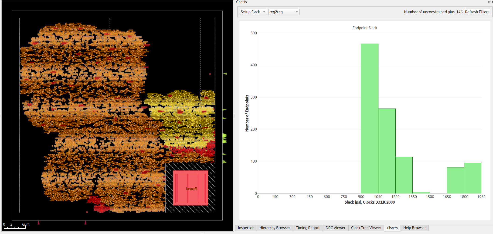
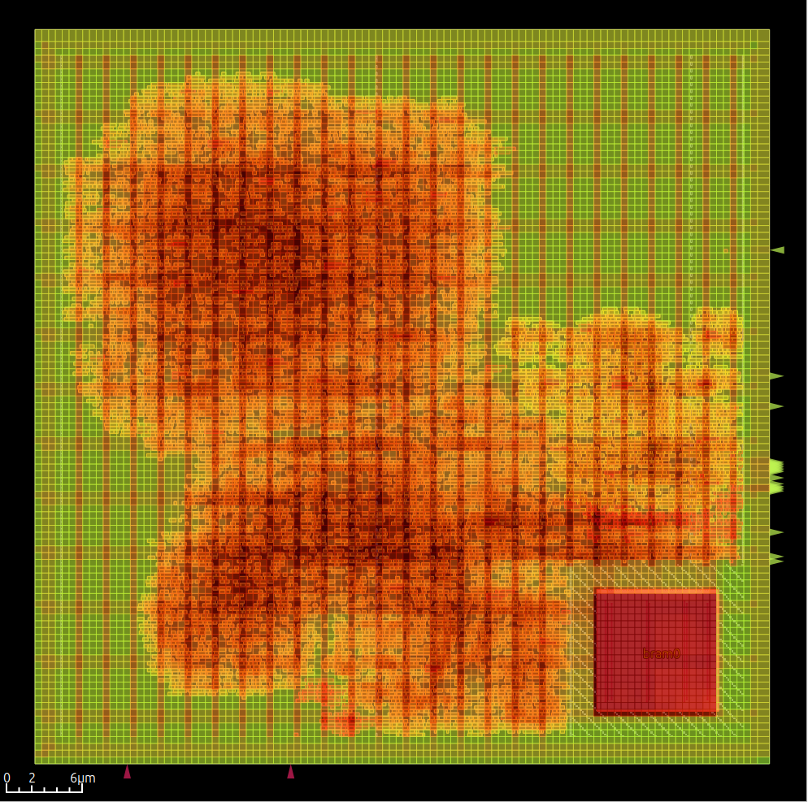

OpenROAD ASAP7 PDK configuration
================================

TL;DR Install Bazelisk and run command below to build and view darksocv in the GUI, Bazelisk handles all depedencies.

Demonstrates how to set up an [bazel-orfs](https://github.com/The-OpenROAD-Project/bazel-orfs) to build darksocv with [OpenROAD-flow-scripts](https://github.com/The-OpenROAD-Project/OpenROAD-flow-scripts)

To build and view [Install Bazelisk](https://bazel.build/install/bazelisk) and run:

    bazelisk run //boards/openroad:darksocv_cts /tmp/cts gui_cts

Register to register histogram
------------------------------

Estimated routing congestion
----------------------------

Ideas for future work
=====================

- reduce clock period
- darkram.v should consist of serveral SRAMs connected together to be
  a more accurate representation
- create a mock SRAM representation with somewhat realistic timing
- add IO constraints to place pins on one edge of the SRAMs and top level
- reduce area

[MegaBoom](https://github.com/The-OpenROAD-Project/megaboom) demonstrates a number of techniques to study a design and set up mock SRAMs.
